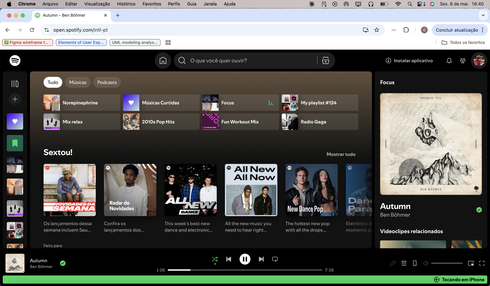
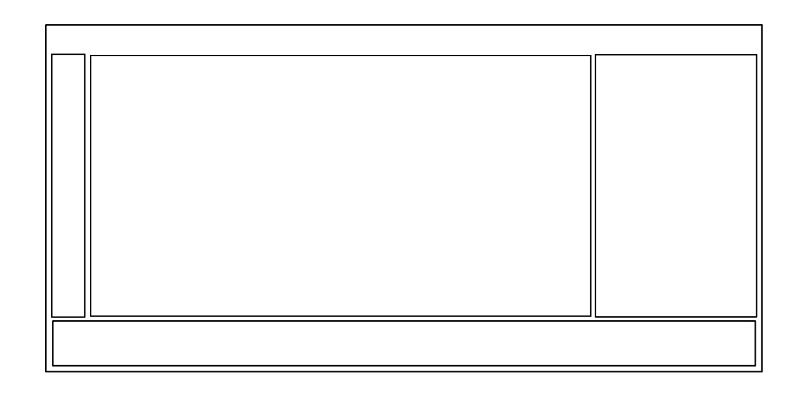
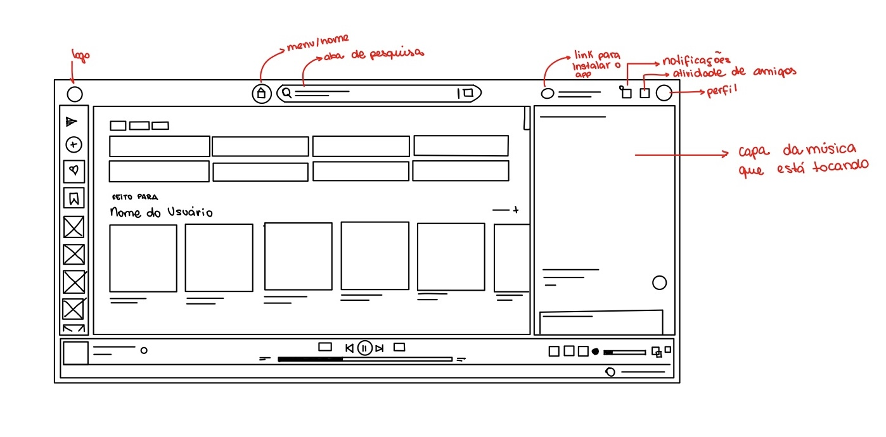

# Atividade Ponderada de Design 01: Análise de interface e Wireframe

# 1. Introdução

&ensp; Esta atividade propõe a análise de uma interface digital com foco na estrutura, organização da informação e decisões de design, utilizando como referência os cinco planos de Jesse James Garrett. O objetivo não é avaliar aspectos estéticos, mas compreender como a interface foi construída e como ela orienta a interação do usuário.

&ensp; O site escolhido foi o [Spotify Web Player](https://open.spotify.com), analisado em sua versão desktop no navegador. A escolha se justifica por ser uma plataforma amplamente utilizada que aplica de forma clara diferentes princípios de UX/UI, como hierarquia visual, navegação contextual e personalização, em um produto digital consolidado, tornando-a adequada para os objetivos propostos pela atividade.

# 2. Sobre a interface:

&ensp;  A interface analisada é a tela inicial do Spotify Web Player no desktop. Ela funciona como o ponto de partida do usuário, reunindo atalhos para conteúdos recentes, playlists favoritas e recomendações personalizadas. O layout segue uma estrutura de três colunas com um player fixo no rodapé. Esse tipo de organização informacional é extremamente comum em aplicativos de streaming, permitindo navegar, descobrir e controlar a reprodução ao mesmo tempo sem perder contexto. 

&ensp; O Spotify é reconhecido como um produto altamente centrado no usuário, com decisões de design que priorizam fluidez, continuidade e personalização da experiência. Dessa forma, a plataforma se encaixa como uma escolha consistente para a proposta da atividade, por apresentar diferentes princípios de UX/UI aplicados de maneira clara em um produto digital real e amplamente consolidado.

## 2.1. Screenshot da tela analisada 

  Figura 1 – Screenshot Spotify Web Player desktop.
  
   

## 2.2. Descrição da interface

&ensp; A tela inicial do Spotify é composta por quatro grandes regiões visuais, cada uma com uma função bem definida dentro da experiência de uso. Essa divisão não é arbitrária, ela reflete decisões de estrutura e hierarquia informacional que organizam o conteúdo de acordo com a frequência e o tipo de interação que o usuário terá com cada área.

&ensp; O objetivo da página é servir como ponto inicial da experiência no Spotify, permitindo que o usuário retome rapidamente conteúdos já conhecidos enquanto explora novas recomendações personalizadas, mantendo os controles de reprodução acessíveis durante toda a navegação.

- **Barra lateral esquerda**: Uma coluna estreita que exibe apenas ícones, sem rótulos de texto, funcionando como o menu de navegação global. É nela que o usuáio encontra os acessos para Home, busca, biblioteca e atalhos para playlists fixadas pelo usuário. A escolha de manter a barra reduzida libera espaço para o conteúdo principal, mas exige que o usuário já reconheça os ícones para navegar sem dificuldade, mantendo um trade-off entre simplicidade e descoberta da interface.

- **Área central (conteúdo principal)**: Ocupa a maior parte da tela e concentra dois blocos de conteúdo com propósitos distintos:

    - **Filtros e atalhos rápidos:** no topo, uma barra de busca e três filtros em pills ("Tudo", "Música", "Podcasts") segmentam o conteúdo. Abaixo, uma grade de 2×4 traz cards compactos com thumbnail e nome de conteúdos recentes, nesse caso: "Norepinephrine", "Músicas Curtidas", "Fun Workout Mix", entre outros. A lógica da interface prioriza o reconhecimento visual, fazendo com que o usuário consiga identificar rapidamente playlists, artistas e conteúdos apenas ao bater o olho nas capas, sem precisar procurar manualmente na biblioteca.

    - **Recomendações personalizadas:** a seção "Feito para Giorgia Scherer" apresenta uma fileira horizontal de cards quadrados dos Daily Mixes (01 a 06), cada um com imagem de capa e artistas representativos. O uso do nome real da usuária reforça a sensação de curadoria individual, aproximando o produto de quem o utiliza e tornando a interface menos genérica.

 - **Painel lateral direito**: Exibe informações expandidas sobre a faixa em reprodução: capa do álbum em tamanho grande, título da música, artista e videoclipes relacionados. Esse painel funciona como uma extensão contextual do player, oferecendo profundidade ao que está tocando sem exigir que o usuário saia da tela inicial, o conteúdo complementar fica acessível sem interromper a navegação principal.

- **Player inferior**: Barra fixa no rodapé que reúne os seguintes componentes:

    - Thumbnail da faixa, título e artista
    - Botões de controle de reprodução (anterior, play/pause, próxima, shuffle, repeat)
    - Barra de progresso interativa com timestamps
    - Controle de volume (slider) e indicador de Spotify Connect, sinalizando que o áudio está sendo reproduzido em outro dispositivo

&ensp; Esse componente é persistente e não desaparece durante a navegação, garantindo que os controles de reprodução permaneçam sempre acessíveis ao usuário, independentemente da seção em que ele esteja. Essa decisão acompanha a principal função da plataforma, mantendo o player disponível de forma contínua sem exigir mudanças de contexto ou retorno para outras telas da interface.

# 3. Análise da interface (Plano de Garrett)

 &ensp; Descrever apenas o que aparece na tela não é suficiente para entender por que uma interface funciona. O modelo de Jesse James Garrett propõe analisar cada elemento visível como resultado de uma sequência de decisões que parte de níveis mais abstratos até chegar à interface final. 
 
 &ensp; A seguir, a tela inicial do Spotify será analisada a partir dessa perspectiva, observando como os planos de Strategy, Scope, Structure, Skeleton e Surface se conectam na construção da experiência do usuário.

### Estratégia (Strategy)

&ensp; O plano de estratégia é o ponto de partida de qualquer produto digital, sendo responsável por definir quais objetivos o produto precisa atender tanto para o negócio quanto para o usuário.

&ensp;No Spotify, os objetivos do produto estão diretamente relacionados ao aumento do tempo de escuta e da retenção dos usuários dentro da plataforma, já que isso sustenta tanto as assinaturas premium quanto o modelo de receita baseado em publicidade.

&ensp; Já do lado do usuário, a principal necessidade é conseguir acessar rapidamente conteúdos conhecidos, retomar reproduções anteriores e descobrir novas músicas sem precisar realizar buscas constantes dentro da plataforma.

&ensp; A Home do Spotify conecta essas duas necessidades de forma bastante natural. Os atalhos rápidos reduzem o caminho entre abrir a plataforma e iniciar uma reprodução, enquanto as recomendações personalizadas ajudam o usuário a descobrir novos conteúdos de maneira mais prática durante a navegação.

&ensp; A seção “Feito para Giorgia Scherer” segue essa mesma lógica ao apresentar recomendações com base no comportamento do usuário dentro da plataforma, neste caso, referentes ao meu perfil apresentado na imagem da seção 2.2. Além de facilitar a descoberta de novos conteúdos, esse tipo de personalização também funciona como um mecanismo de retenção, incentivando o retorno frequente à plataforma e aumentando o tempo de permanência durante o uso.

### Escopo (Scope)
&ensp; Com a estratégia definida, o plano de escopo determina quais funcionalidades e conteúdos precisam existir na interface para atender aos objetivos do produto e às necessidades do usuário. Na Home do Spotify, isso inclui atalhos para conteúdos recentes, recomendações personalizadas, sistema de busca, filtros por tipo de conteúdo e um player contínuo com informações sobre a reprodução atual.

&ensp; O escopo da página também demonstra uma seleção intencional do que deve ou não receber destaque dentro da interface. Elementos como configurações avançadas, métricas de perfil ou funcionalidades sociais não ocupam espaço central na Home, já que não contribuem diretamente para o principal objetivo da página, que é facilitar o acesso rápido à reprodução e à descoberta de conteúdos.

&ensp; Essa delimitação evita que a interface acumule funcionalidades sem relação clara com os objetivos definidos no plano de estratégia. Como consequência, a navegação permanece mais direta, reduzindo excesso de informação e diminuindo o esforço necessário para que o usuário encontre e reproduza conteúdos rapidamente.

### Estrutura (Structure)
&ensp; O plano de estrutura organiza tudo que o escopo definiu, é onde se decide como os conteúdos se relacionam entre si e como o usuário vai navegar entre eles, através da arquitetura da informação e do design de interação. 

&ensp;Na Home do Spotify, a hierarquia informacional espelha o comportamento mais provável do usuário. Os atalhos rápidos vêm antes das recomendações porque quem abre o Spotify geralmente quer retomar algo conhecido, não explorar do zero. As recomendações aparecem logo abaixo, prontas para capturar a atenção de quem não tinha nada específico em mente. O painel lateral contextualiza o que está tocando sem disputar espaço com o conteúdo principal, e o player fixo no rodapé garante que o controle de áudio nunca dependa de navegação.

&ensp;O design de interação reforça essa lógica, já que o fluxo natural vai de reconhecer algo familiar nos atalhos, iniciar a reprodução e seguir ouvindo enquanto explora o restante da página. Não há etapas intermediárias, confirmações desnecessárias ou mudanças de contexto. A interação é progressiva e contínua — o usuário vai de intenção a ação em poucos cliques, enquanto a interface mantém a navegação fluida e a reprodução sempre acessível durante o uso.

### Esqueleto (Skeleton)

&ensp; O esqueleto é o plano onde as decisões de estrutura ganham posição física na tela, onde cada elemento vai ficar, como a navegação se distribui e como a informação é organizada espacialmente. É também o plano onde vivem os wireframes e onde o sistema de grid começa a se manifestar, temas que serão retomados mais adiante no desenvolvimento do wireframe.

  &ensp; Na Home do Spotify, três escolhas de esqueleto se destacam.

- O layout em três colunas cria zonas funcionais fixas, navegação à esquerda, conteúdo ao centro e contexto à direita. Essa divisão, sustentada por um grid bem definido, gera previsibilidade durante o uso, já que o usuário aprende rapidamente onde procurar dependendo da ação que deseja realizar, sem precisar reaprender a interface a cada acesso.

- A grade de atalhos em 2×4 equilibra densidade informacional e legibilidade. Oito itens conseguem ocupar pouco espaço vertical sem comprometer a leitura, enquanto o formato retangular com thumbnail à esquerda e texto à direita favorece a escaneabilidade da interface. Nesse contexto, o reconhecimento visual passa a ser mais importante do que a leitura detalhada dos títulos.

- O player ancorado no rodapé é talvez a decisão de esqueleto mais relevante da interface. Ao torná-lo persistente, o Spotify garante que a principal funcionalidade do produto permaneça sempre acessível ao usuário durante a navegação.

&ensp; Vale notar que mesmo um wireframe simples dessa página, sem cores, tipografia ou elementos visuais detalhados, já conseguiria comunicar essa lógica estrutural com clareza, algo que poderá ser observado de forma mais evidente na seção 4 deste trabalho. Isso evidencia como o esqueleto da interface sustenta a navegação e a organização da experiência antes mesmo da aplicação da camada visual.

### Superfície (Surface)

&ensp; A superfície é a camada que o usuário efetivamente vê, sendo elas as cores, tipografia, imagens, espaçamento. É o plano mais visível, embora, como Garrett aponta, seja o menos determinante para o sucesso da experiência quando as camadas anteriores estão mal resolvidas. No Spotify, porém, a superfície amplifica um esqueleto que já funciona bem.

&ensp; O fundo escuro não é uma escolha de tendência, ele é funcional. Preto e cinza escuro reduzem fadiga visual em sessões longas e criam contraste natural com as capas de álbuns, que são o conteúdo visual mais relevante da página. As thumbnails coloridas se destacam sem precisar de bordas, setas ou indicadores adicionais. O próprio uso de contraste faz o trabalho de guiar o olhar.

&ensp;  A tipografia segue uma hierarquia bem consistente, de forma que os títulos de seção apresentem peso maior, nomes de playlists em tamanho intermediário e informações complementares em texto menor e cor mais suave. Essa gradação atende tanto quem escaneia rápido quanto quem explora com calma, sem exigir mudança de comportamento de leitura entre as seções.

&ensp; O verde característico do Spotify aparece de forma bem controlada na interface, principalmente em elementos interativos e indicadores de estado, como a barra de progresso, ícones de confirmação e recursos ativos. Como a cor não é utilizada em excesso, ela ajuda a reforçar a identidade visual da plataforma sem competir visualmente com as capas, que continuam sendo o principal ponto de atenção durante a navegação.

### Conclusão 
&ensp; A análise da Home do Spotify a partir dos planos de Jesse James Garrett mostra como cada camada da experiência é construída de forma progressiva, em que decisões mais abstratas influenciam diretamente aquilo que chega à interface final. A clareza estratégica sobre retenção e facilidade de acesso influencia o escopo da plataforma, que seleciona funcionalidades voltadas principalmente à reprodução contínua e à descoberta de conteúdo. A partir disso, a estrutura organiza os fluxos de navegação priorizando retomada rápida e continuidade de uso, enquanto o esqueleto transforma essas decisões em zonas funcionais previsíveis dentro da interface. Por fim, a superfície reforça essa lógica por meio de hierarquia visual, contraste e padronização dos elementos.

&ensp; O modelo proposto por Garrett ajuda a mostrar que boas interfaces não surgem apenas de escolhas visuais bem executadas. Antes das cores, tipografia ou componentes gráficos, existe uma sequência de decisões relacionadas aos objetivos do produto, às necessidades do usuário e à forma como a navegação será construída. Na Home do Spotify, cada elemento da interface possui uma função clara dentro da experiência proposta pela plataforma, o que faz com que a navegação pareça simples, fluida e intuitiva durante o uso.

# 4. Wireframe

&ensp; Após analisar a interface do Spotify pelos planos de Garrett, fica claro que o esqueleto da página sustenta a experiência antes mesmo de qualquer elemento visual ser aplicado. O wireframe é justamente a ferramenta que permite testar essa lógica estrutural de forma rápida, construindo um esboço de baixa fidelidade focado exclusivamente em posicionamento, hierarquia e funcionalidade. Sua função não é representar como a interface vai parecer, mas sim validar como ela vai funcionar.

### 4.1. Grid

&ensp; Antes de desenhar o wireframe, porém, é importante definir o sistema de grid que vai organizar a disposição dos elementos na tela. O grid é a estrutura invisível que sustenta o layout, garantindo alinhamento, consistência e proporção entre as áreas da interface. 

&ensp; No caso do Spotify, a divisão em três colunas (barra lateral estreita, área central ampla e painel contextual à direita, além do player fixo no rodapé), segue uma lógica de grid que distribui o espaço de acordo com a importância funcional de cada região. Definir esse grid antes de posicionar qualquer elemento é o que garante que o wireframe não seja apenas um conjunto de caixas soltas, mas sim uma representação coerente da arquitetura da página.

  Figura 2 – Wireframe com Foco no Grid
  
   

### 4.2. Wireframe Desenhado da Interface

&ensp;  Com o grid definido, o passo seguinte foi desenhar o wireframe da tela inicial do Spotify Web Player com base nessa estrutura. O objetivo foi representar as quatro regiões identificadas na análise de forma simples. Mesmo sem cores, imagens ou tipografia, o wireframe já consegue comunicar a lógica de navegação e a hierarquia informacional da interface, reforçando como o esqueleto da página sustenta a organização da experiência antes da camada visual.

  Figura 3 – Wireframe do Spotify Web Player desktop.
  
   

# 5. Revisão do colega:

## 5.1. Nome do revisor

## 5.2. Feedback recebido

## 5.3. Demonstração da melhoria (antes x depois da revisão)